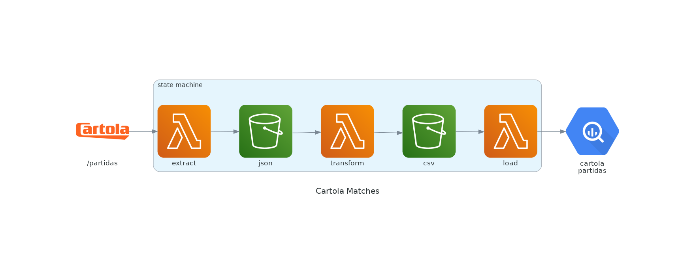
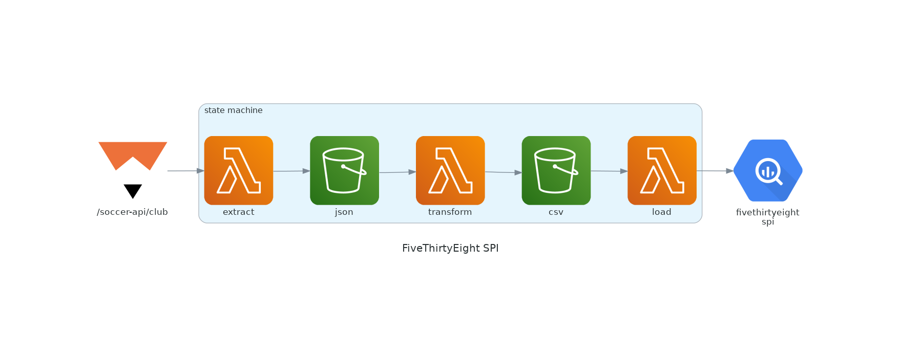
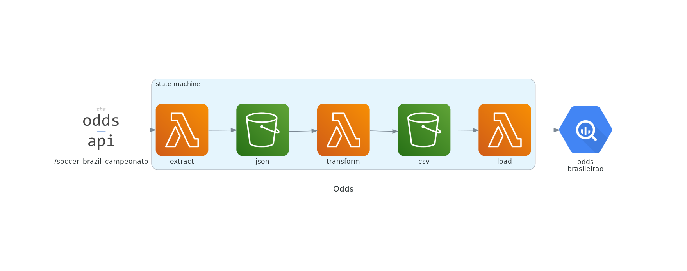

# :soccer: Palpiteiro ETL
Points prediction for the fantasy soccer app.

## ETLs
ETLs are AWS step functions that reads the API, saves raw data in a S3 bucket and loads into GCP Big Query.

### Cartola Players
Players data from Cartola API comes in a nested JSON. It is stored as it is in S3, flatten into a CSV, which is also stored and finally loaded into google big query.

### Cartola Scouts
Players scouts data from Cartola API comes in a nested JSON. It is stored as it is in S3, flatten into a CSV, which is also stored and finally loaded into google big query.

### Cartola Matches
Matches data from Cartola API comes in a nested JSON. It is stored as it is in S3, flatten into a CSV, which is also stored and finally loaded into google big query.

### FiveThirtyEight SPI
Soccer Power Index data from FiveThirtyEight API already comes in CSV, so it just need to be stored as it is in S3 and loaded into Google Big Query.

### Odds
Odds data from The Odds API comes in a nested JSON. It is stored as it is in S3, flatten into a CSV, which is also stored and finally loaded into google big query.
